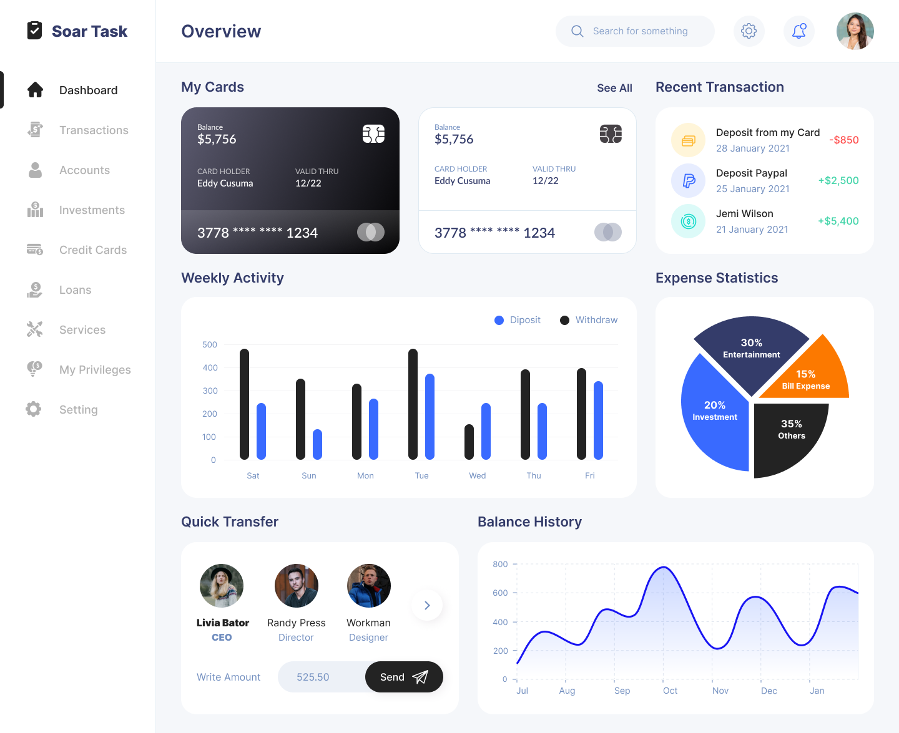

# Banking Dashboard

A modern, responsive banking dashboard built with React, TypeScript, and Vite. Features include expense tracking, transaction management, and financial analytics.



## 🚀 Features

- 📊 Real-time financial analytics and charts
- 💳 Credit card management
- 📱 Responsive design (mobile-first approach)
- 🔄 Transaction history and tracking
- 📈 Expense statistics
- 👤 User profile management
- 🌙 Accessibility optimized

## 🛠️ Tech Stack

- React 18.3
- TypeScript
- Vite
- Redux Toolkit
- Chart.js
- TailwindCSS
- React Router DOM

## 📋 Prerequisites

- Node.js (v18 or higher)
- npm or yarn
- Git

## 🚀 Quick Start

1. **Clone the repository**
```bash
git clone https://github.com/vivekneem/banking-dashboard.git
cd banking-dashboard
```

2. **Install dependencies**
```bash
npm install
# or
yarn install
```

3. **Start development server**
```bash
npm run dev
# or
yarn dev
```

Visit `http://localhost:5173` to view the application.

## 🏗️ Build for Production

```bash
npm run build
# or
yarn build
```

The built files will be in the `dist` directory.

## 📝 Development Assumptions

1. **Mock API Integration**
   - Mock API endpoints available for all data operations
   - Proper error handling and status codes

2. **Browser Support**
   - Modern browsers (last 2 versions)
   - CSS Grid and Flexbox support
   - ES6+ JavaScript features

3. **Data Management**
   - Redux for global state management
   - Local storage for user preferences
   - Real-time data updates

## 📁 Project Structure

```
banking-dashboard/
├── src/
│   ├── components/     # Reusable UI components
│   ├── pages/         # Page components
│   ├── store/         # Redux store configuration
│   ├── hooks/         # Custom React hooks
│   ├── types/         # TypeScript type definitions
│   ├── assets/        # Static assets
│   └── App.tsx        # Root component
├── public/            # Public assets
└── vite.config.ts     # Vite configuration
```

## 📱 Responsive Design Breakpoints

- Mobile: < 640px
- Tablet: 640px - 1024px
- Desktop: > 1024px

## 🤝 Contributing

1. Fork the repository
2. Create your feature branch (`git checkout -b feature/AmazingFeature`)
3. Commit your changes (`git commit -m 'Add some AmazingFeature'`)
4. Push to the branch (`git push origin feature/AmazingFeature`)
5. Open a Pull Request

## 📄 License

This project is licensed under the MIT License - see the [LICENSE](LICENSE) file for details.

## 👥 Authors

- Vivek Desai - Initial work - [vivekneem](https://github.com/vivekneem)

## 🙏 Acknowledgments

- [React Documentation](https://react.dev)
- [Vite](https://vitejs.dev)
- [TailwindCSS](https://tailwindcss.com)
- [Chart.js](https://www.chartjs.org)
